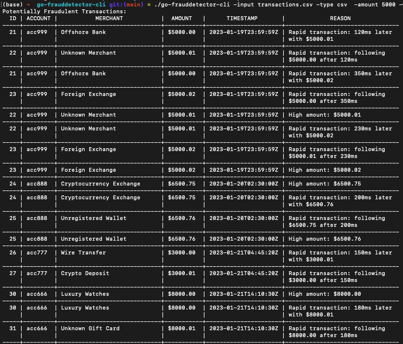

# Fraud Detector CLI

A command-line tool for detecting potentially fraudulent transactions in financial data. The tool analyzes transactions for suspicious patterns such as high amounts and rapid successive transactions from the same account.

## Features

- Supports both CSV and JSON input files
- Concurrent processing using goroutines
- Configurable thresholds for fraud detection
- Pretty table output in terminal
- JSON export capability
- Two fraud detection rules:
  - High amount transactions
  - Rapid successive transactions

## Installation

1. Clone the repository:

```bash
git clone https://github.com/alxzndr2019/fraud-detector-cli
cd go-frauddetector-cli
```

2. Install dependencies:

```bash
go get github.com/olekukonko/tablewriter
```

3. Build the program:

```bash
go build
```

## Usage

Basic usage with default settings:

```bash
./go-frauddetector-cli -input transactions.csv
```

### Command Line Options

- `-input`: Path to input file (default: "transactions.csv")
- `-type`: Input file type ("csv" or "json") (default: "csv")
- `-amount`: High amount threshold for fraud detection (default: 1000.0)
- `-window`: Time window in minutes for rapid transaction detection (default: 5)
- `-output`: Output file path for JSON export (optional)

### Example Commands

Analyze JSON file with custom thresholds:

```bash
./go-frauddetector-cli -input data.json -type json -amount 5000 -window 10
```

Export results to JSON:

```bash
./go-frauddetector-cli -input transactions.csv -output flagged.json
```

## Input File Formats

### CSV Format

```csv
id,amount,timestamp,account_id,merchant
1,1500.00,2024-03-20T10:00:00Z,ACC123,Store A
2,2000.00,2024-03-20T10:02:00Z,ACC123,Store B
```

### JSON Format

```json
[
  {
    "id": "1",
    "amount": 1500.0,
    "timestamp": "2024-03-20T10:00:00Z",
    "account_id": "ACC123",
    "merchant": "Store A"
  }
]
```

## Example Output



_[Add a screenshot of the tool's table output here]_

## Fraud Detection Rules

1. **High Amount Rule**: Flags transactions above the specified amount threshold
2. **Rapid Succession Rule**: Flags transactions from the same account that occur within the specified time window

## Performance

- Processes transactions in batches using goroutines
- Default batch size: 100 transactions
- Concurrent processing for improved performance on large datasets

## Error Handling

The tool handles various error cases:

- Invalid file formats
- Missing input files
- Malformed data entries
- Invalid timestamps
- File permission issues

## Contributing

1. Fork the repository
2. Create your feature branch (`git checkout -b feature/AmazingFeature`)
3. Commit your changes (`git commit -m 'Add some AmazingFeature'`)
4. Push to the branch (`git push origin feature/AmazingFeature`)
5. Open a Pull Request

## License

MIT

## Author

Alex Omiunu

---
